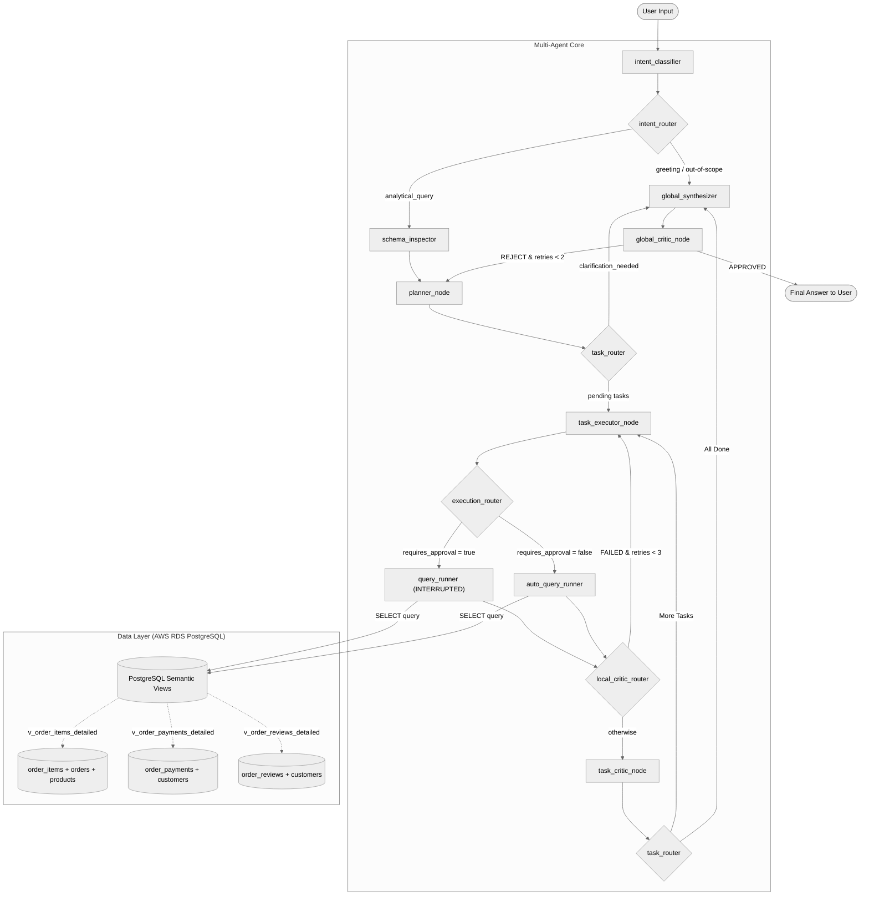

# Olist E-Commerce Advanced SQL Agent


An intelligent, production-grade natural language SQL agent for analyzing the **Olist Brazilian E-Commerce Dataset** on AWS RDS. Built using **FastAPI**, **LangGraph**, and **Groq Cloud API** models, featuring a hardened **Planner-Executor-Critic** loop, hybrid auto-run routing, conversational memory checkpoints, and token-limit failover protection.

---

## 📊 Dataset & Kaggle Reference

This project is built using the **Brazilian E-Commerce Public Dataset by Olist**, which contains real, anonymized transactional data from 100k orders placed between 2016 and 2018 in Brazil.

*   **Official Kaggle Link:** [Brazilian E-Commerce Public Dataset by Olist](https://www.kaggle.com/datasets/olistbr/brazilian-ecommerce)
*   **Database Engine:** Hosted on AWS RDS PostgreSQL.
*   **Dataset Structure:** Includes orders, order items, product details, customer geography, payment installment metrics, and written customer reviews.

---

## 🧠 How the Agent Works (LangGraph Workflow)

The agent does not just naively generate SQL and run it. It runs an advanced **Planner-Executor-Critic** loop built using LangGraph nodes, which mimics the behavior of a professional database analyst.

### 1. Workflow Architecture Diagram
The graph below illustrates how user requests flow dynamically through schema inspection, planning, execution, and local/global audits:



### 2. Node Roles & Model Allocations
To achieve maximum SQL generation accuracy and reasoning quality, tasks are distributed between the high-capacity **Large Model (70B class)** and the fast, token-efficient **Small Model (27B class)**:

| Node Name | Model Utama (1st Choice) | Fallback Models | Technical Role |
|---|---|---|---|
| **Intent Classifier** | `qwen/qwen3.6-27b` | `openai/gpt-oss-20b` | Classifies query intent (greetings, out-of-scope, or data query) before schema inspection. |
| **Planner** | `llama-3.3-70b-versatile` | `openai/gpt-oss-120b` | Decomposes complex questions into a structured plan (JSON object). |
| **Task Executor** | `llama-3.3-70b-versatile` | `openai/gpt-oss-120b` | Generates highly accurate PostgreSQL SELECT statements using CTEs, GROUP BY, and aggregates. |
| **Task Critic** | `llama-3.3-70b-versatile` | `openai/gpt-oss-120b` | Local error checker. Audits successful queries that return 0 rows to detect logical JOIN failures. |
| **Global Synthesizer**| `llama-3.3-70b-versatile` | `openai/gpt-oss-120b` | Synthesizes query results into natural English/Indonesian reports. |
| **Global Critic** | `llama-3.3-70b-versatile` | `openai/gpt-oss-120b` | Rigorous quality auditor checking for hallucinations against dataset context. |

### 3. Semantic Views Layer (Database Optimization)
We deployed 3 database views to pre-clean relationships and **shrink schema context size by 55%**, preventing token rate limits and mathematical errors (such as the *Fan Effect* payment duplication):
*   `v_order_items_detailed`: Pre-joins items, orders, products, translations, and seller states.
*   `v_order_payments_detailed`: Safe payment aggregates (prevents payment multiplication from items *Fan Effect*).
*   `v_order_reviews_detailed`: Consolidates customer reviews and ratings.

---

## 🌐 Live Demo & Security (API Abuse Protection)

The application is deployed and available for interactive testing:
*   **Live URL:** **[https://olist-chatbot.vercel.app/](https://olist-chatbot.vercel.app/)**
*   **Access Passcode:** **`olist2026`**

### 🛡️ Why is there a passcode?
Since this portfolio project connects to a live **AWS RDS PostgreSQL** instance and utilizes the **Groq API**, it is vulnerable to quota depletion from generic scraper bots. To safeguard the API keys and database from abuse, a **Passcode Gatekeeping** architecture was implemented:

1.  **Backend Gatekeeping:** A custom FastAPI middleware intercepts all `/api/*` requests. If `DEMO_PASSCODE` is configured on the host, the backend rejects any requests lacking a matching `X-Demo-Passcode` HTTP header with a `401 Unauthorized` status.
2.  **Frontend Authenticated Wrapper:** The client application intercepts `401` responses and displays a sleek fullscreen authentication overlay. Once unlocked, the passcode is persisted securely in the browser's `localStorage` so recruiters only need to enter it once.
3.  **Bot Prevention:** Automated scraping scripts and unauthorized direct API requests are blocked at the middleware layer, preventing API key depletion and unnecessary database load.


---

## 🧪 Demo Verification Results

Here are actual verification outputs tested directly on the production container:

### Test Case 1: Simple Database Retrieval (Auto-Run)
*   **User Question:** *"how many buyers are in Bekasi?"*
*   **Agent Classification:** Standard & Confident (`requires_approval = false`).
*   **SQL Executed automatically:**
    ```sql
    SELECT COUNT(DISTINCT customer_unique_id) FROM customers WHERE customer_city = 'bekasi';
    ```
*   **Final Answer returned in a single round-trip:**
    > "Based on the database query execution, the number of buyers in Bekasi is **0**."

---

### Test Case 2: Complex Comparison Query (Self-Healed, Auto-Run)
*   **User Question:** *"which product is the best selling, and is that product also the one with the highest rating?"*
*   **Agent Flow:**
    1.  *First attempt:* Model attempts to INNER JOIN top-sold and top-rated products on `product_id`. Returns `0 rows`.
    2.  *Critic Audit:* Task Critic detects `0 rows` $\rightarrow$ Triggers **AI SQL Auditor** $\rightarrow$ Diagnoses logical error.
    3.  *Self-Healing:* Generates a safe **CROSS JOIN** query:
        ```sql
        SELECT 
            (SELECT product_id FROM v_order_items_detailed GROUP BY product_id ORDER BY COUNT(*) DESC LIMIT 1) AS best_selling_product,
            (SELECT AVG(review_score) FROM v_order_reviews_detailed r JOIN v_order_items_detailed oi ON r.order_id = oi.order_id WHERE oi.product_id = (SELECT product_id FROM v_order_items_detailed GROUP BY product_id ORDER BY COUNT(*) DESC LIMIT 1)) AS best_selling_average_rating,
            (SELECT AVG(review_score) FROM v_order_reviews_detailed r JOIN v_order_items_detailed oi ON r.order_id = oi.order_id GROUP BY oi.product_id ORDER BY AVG(review_score) DESC LIMIT 1) AS highest_rated_product,
            CASE 
                WHEN (SELECT product_id FROM v_order_items_detailed GROUP BY product_id ORDER BY COUNT(*) DESC LIMIT 1) = (SELECT product_id FROM v_order_reviews_detailed r JOIN v_order_items_detailed oi ON r.order_id = oi.order_id GROUP BY oi.product_id ORDER BY AVG(review_score) DESC LIMIT 1) THEN 'Yes'
                ELSE 'No'
            END AS are_same_product
        ```
    4.  *Execution:* Succeeded.
*   **Final Answer:**
    > **Analysis Summary**
    > *   **Best-selling product:** ID `aca2eb7d00ea1a7b8ebd4e68314663af` (Rating: 4.02/5)
    > *   **Highest average rating:** 5.00/5 (Different Product)
    > *   **Is the best-selling product also the one with the highest rating?** No

---

## 🚀 Local Deployment Setup

1.  **Clone the Repository:**
    ```bash
    git clone https://github.com/Roberttwil/Olist.git
    cd Olist
    ```
2.  **Environment Setup:**
    ```bash
    cp .env.template .env
    # Fill in DB_HOST, DB_NAME, DB_USER, DB_PASSWORD, GROQ_API_KEYs
    ```
3.  **Run via Docker (easiest):**
    ```bash
    docker-compose up --build -d
    ```
4.  **Access App:**
    Open browser at **[http://127.0.0.1:8000](http://127.0.0.1:8000)**.
