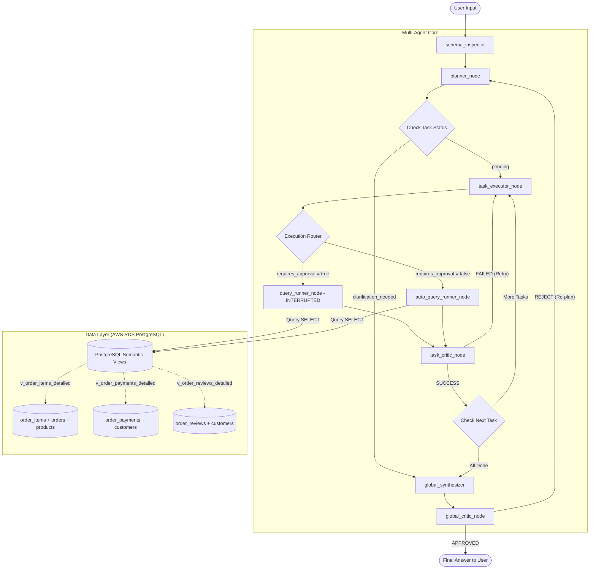

# Olist E-Commerce Advanced SQL Agent

An intelligent, production-grade natural language SQL agent for analyzing the **Olist Brazilian E-Commerce Dataset** on AWS RDS. Built using **FastAPI**, **LangGraph**, and **Groq Cloud API** models, featuring a hardened **Planner-Executor-Critic** loop, hybrid auto-run routing, conversational memory checkpoints, and token-limit failover protection.

---

## 📊 Dataset & Kaggle Reference

This project is built using the **Brazilian E-Commerce Public Dataset by Olist**, which contains real, anonymized transactional data from 100k orders placed between 2016 and 2018 in Brazil.

*   **Official Kaggle Link:** [Brazilian E-Commerce Public Dataset by Olist](https://www.kaggle.com/datasets/olistbr/brazilian-ecommerce)
*   **Database Engine:** Hosted on AWS RDS PostgreSQL.
*   **Dataset Structure:** Includes orders, order items, product details, customer geography, payment installment metrics, and written customer reviews.

---

## 🧠 How the Agent Works (LangGraph Workflow)

The agent does not just naively generate SQL and run it. It runs an advanced **Planner-Executor-Critic** loop built using LangGraph nodes, which mimics the behavior of a professional database analyst.

### 1. Workflow Architecture Diagram
The graph below illustrates how user requests flow dynamically through schema inspection, planning, execution, and local/global audits:



### 2. Node Roles & Model Allocations
To maintain speed and reduce token costs, tasks are divided between high-capacity **Large Models** and fast, token-efficient **Small Models**:

| Node Name | Model Utama (1st Choice) | Fallback Models | Technical Role |
|---|---|---|---|
| **Planner** | `llama-3.3-70b-versatile` | `openai/gpt-oss-120b`<br>`qwen/qwen3-32b` | Decomposes questions into a JSON task sequence. Handles greetings and clarify relative times (relative time expressions). |
| **Task Executor** | `llama-3.1-8b-instant` | `qwen/qwen3.6-27b`<br>`openai/gpt-oss-20b` | Generates pure PostgreSQL SELECT syntax. |
| **Task Critic** | `llama-3.1-8b-instant` | `llama-3.3-70b-versatile` | Local error checker. Invokes AI SQL Auditor if a query succeeds but returns 0 rows (detecting logical JOIN errors). |
| **Global Synthesizer**| `llama-3.3-70b-versatile` | `openai/gpt-oss-120b` | Merges query outputs into natural Indonesian reports. |
| **Global Critic** | `llama-3.3-70b-versatile` | `openai/gpt-oss-120b` | Rigorous QA auditor checking for hallucinations against history. |

### 3. Semantic Views Layer (Database Optimization)
We deployed 3 database views to pre-clean relationships and **shrink schema context size by 55%**, preventing token rate limits and mathematical errors (such as the *Fan Effect* payment duplication):
*   `v_order_items_detailed`: Pre-joins items, orders, products, translations, and seller states.
*   `v_order_payments_detailed`: Safe payment aggregates (prevents payment multiplication from items *Fan Effect*).
*   `v_order_reviews_detailed`: Consolidates customer reviews and ratings.

---

## 🔒 Vercel Deployment & API Abuse Protection (Groq Key Safeguards)

If you deploy your chatbot frontend publicly (e.g., to Vercel), anyone visiting the site could spam requests and drain your free Groq API keys. To prevent this, this project features **Passcode Demo Gatekeeping**:

### 1. How It Works
*   **Backend Protection:** A global FastAPI middleware (`check_demo_passcode_middleware`) intercepts all `/api/*` endpoints. If the environment variable `DEMO_PASSCODE` is set (e.g. `DEMO_PASSCODE=olist2026`), the backend demands a matching passcode in the `X-Demo-Passcode` HTTP header.
*   **Frontend Authentication Wrapper (`app.js`):** The frontend wraps all network calls in an `authenticatedFetch` helper. If the backend returns `401 Unauthorized` (passcode missing or incorrect), the browser pops up a passcode prompt. The entered passcode is saved to `localStorage` so recruiters only have to type it once.
*   **Security:** Unauthorized scraper bots or public visitors cannot make LLM calls or access AWS RDS.

### 2. Setting Up Passcode Protection
Add this line to your `.env` file on Vercel or your hosting provider:
```env
DEMO_PASSCODE=olist2026
```
*(Leave it blank or commented out in your local development environment to bypass the passcode check on localhost).*

> [!TIP]
> **Live Demo Access Code:** If you are accessing the deployed live demonstration, enter the passcode **`olist2026`** when prompted by the web interface. This unlocks secure live querying to the AWS RDS database.

---

## 🧪 Demo Verification Results

Here are actual verification outputs tested directly on the production container:

### Test Case 1: Simple Database Retrieval (Auto-Run)
*   **User Question:** *"berapa pembeli di bekasi?"*
*   **Agent Classification:** Standard & Confident (`requires_approval = false`).
*   **SQL Executed automatically:**
    ```sql
    SELECT COUNT(DISTINCT customer_unique_id) FROM customers WHERE customer_city = 'bekasi';
    ```
*   **Final Answer returned in a single round-trip:**
    > "Berdasarkan hasil eksekusi query database, jumlah pembeli di Bekasi adalah **0**."

---

### Test Case 2: Complex Comparison Query (Self-Healed, Auto-Run)
*   **User Question:** *"product apa yg paling laku, apakah produk itu juga yg punya rating tertinggi?"*
*   **Agent Flow:**
    1.  *First attempt:* Model attempts to INNER JOIN top-sold and top-rated products on `product_id`. Returns `0 rows`.
    2.  *Critic Audit:* Task Critic detects `0 rows` $\rightarrow$ Triggers **AI SQL Auditor** $\rightarrow$ Diagnoses logical error.
    3.  *Self-Healing:* Generates a safe **CROSS JOIN** query:
        ```sql
        SELECT 
            (SELECT product_id FROM v_order_items_detailed GROUP BY product_id ORDER BY COUNT(*) DESC LIMIT 1) AS best_selling_product,
            (SELECT AVG(review_score) FROM v_order_reviews_detailed r JOIN v_order_items_detailed oi ON r.order_id = oi.order_id WHERE oi.product_id = (SELECT product_id FROM v_order_items_detailed GROUP BY product_id ORDER BY COUNT(*) DESC LIMIT 1)) AS best_selling_average_rating,
            (SELECT AVG(review_score) FROM v_order_reviews_detailed r JOIN v_order_items_detailed oi ON r.order_id = oi.order_id GROUP BY oi.product_id ORDER BY AVG(review_score) DESC LIMIT 1) AS highest_rated_product,
            CASE 
                WHEN (SELECT product_id FROM v_order_items_detailed GROUP BY product_id ORDER BY COUNT(*) DESC LIMIT 1) = (SELECT product_id FROM v_order_reviews_detailed r JOIN v_order_items_detailed oi ON r.order_id = oi.order_id GROUP BY oi.product_id ORDER BY AVG(review_score) DESC LIMIT 1) THEN 'Yes'
                ELSE 'No'
            END AS are_same_product
        ```
    4.  *Execution:* Succeeded.
*   **Final Answer:**
    > **Ringkasan Hasil Analisis**
    > *   **Produk paling laku:** ID `aca2eb7d00ea1a7b8ebd4e68314663af` (Rating: 4.02/5)
    > *   **Rating rata-rata tertinggi:** 5.00/5 (Produk Lain)
    > *   **Apakah produk paling laku memiliki rating tertinggi?** Tidak (`No`)

---

## 🚀 Local Deployment Setup

1.  **Clone the Repository:**
    ```bash
    git clone https://github.com/your-username/olist-sql-agent.git
    cd olist-sql-agent
    ```
2.  **Environment Setup:**
    ```bash
    cp .env.template .env
    # Fill in DB_HOST, DB_NAME, DB_USER, DB_PASSWORD, GROQ_API_KEYs
    ```
3.  **Run via Docker (easiest):**
    ```bash
    docker-compose up --build -d
    ```
4.  **Access App:**
    Open browser at **[http://127.0.0.1:8000](http://127.0.0.1:8000)**.
